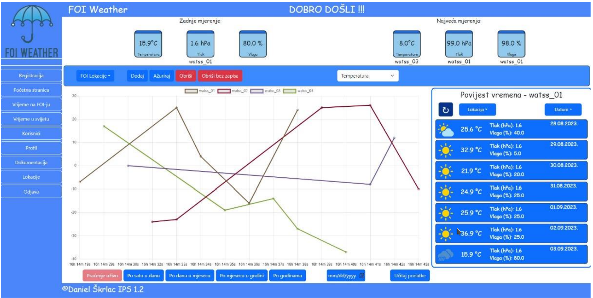

# Table of Contents
- [Domain Description](#domain-description)
- [Application Functionalities Overview](#application-functionalities-overview)
- [Project Specification](#project-specification)
    - [Project Architecture](#project-architecture)
    - [Project Modularization](#project-modularization)
    - [Entity-Relationship Diagram](#entity-relationship-diagram)
        - [MySQL ER Diagram](#mysql-er-diagram)
        - [MongoDB ER Diagram](#mongodb-er-diagram)
- [FOI Weather Interface](#foi-weather-interface)
- [Usage](#usage)

# FOI Weather

The Reactive FOI Weather Application is a dynamic web platform offering real-time weather updates for the FOI lab and global locations, powered by reactive programming principles, ReactiveX, and WebSocket technology.

## Domain Description

The application is a dynamic platform that leverages reactive programming principles through the utilization of ReactiveX and WebSocket technologies. By integrating ReactiveX, it employs reactive aspects to handle asynchronous events efficiently, ensuring seamless data flow and responsiveness. Additionally, the application integrates WebSocket with MongoDB active database implementation, enabling real-time communication and updates between clients and the server.


*Reactive MongoDB: A representation of the interaction between the application aspects showing reactive approach using MongoDB reactive implementation.*


## Application Functionalities Overview

The provided text delineates a comprehensive overview of the functionalities outlined in a use case diagram within an application:

1. **Registration Functionality**: Available to all types of users within the application, the registration feature allows users to create accounts and access the system.

2. **Login, Logout, and Profile Update**: Users, including those with higher hierarchical roles, such as administrators, professors, and other privileged users, can log in, log out, and update their profiles. Additionally, profile activation through email confirmation enhances security and user verification processes.

3. **Viewing FOI Locations**: Users have the capability to browse and explore FOI (Faculty of Organization and Informatics) locations within the application. They can also filter location data to tailor their browsing experience.

4. **Viewing Additional Cities**: In addition to FOI locations, users can explore data from other cities integrated into the system. They have the option to filter data based on specific criteria such as hourly, daily, monthly, and yearly averages of various parameters.

5. **Viewing Data History**: Users can delve into the historical data of FOI locations and other cities within a seven-day range. This feature allows users to track and analyze trends over time.

6. **Forecasting**: The application provides users with forecasts for the next five days, enabling them to plan activities and make informed decisions based on anticipated weather conditions.

7. **Managing FOI Locations**: Professors, as key stakeholders, possess the authority to manage FOI locations within the system. This includes tasks such as adding new locations, updating existing ones, and removing locations without recorded measurements.

8. **Managing City Data**: Professors have access to an API key that allows them to add new data to the system. This feature empowers them to enrich the application's database with relevant information.

9. **Data Retrieval**: City data and forecasts are retrieved from an external API, `OpenWeatherAPI`. This integration ensures that the application remains up-to-date with the latest weather information.

10. **Automatic Data Retrieval**: A Worker thread periodically retrieves new data from the external API, ensuring that the application's data remains current and accurate.

11. **Administrator Functions**: Administrators wield significant control over user data and system management. They can delete, block, or update user information as well as remove cities from the external API, thereby maintaining data integrity and system efficiency.

In summary, the application encompasses a wide array of functionalities catering to diverse user needs and administrative requirements. From user registration to data management and forecasting.


## Project Specification

### Project Architecture


*The diagram illustrates the architecture of the `FOI Weather` Web application at the highest level of abstraction.*

### Project Modularization

The application is built using the `NestJS` framework, which is based on the `TypeScript` programming language. Below, we outline the defined module structure of the NestJS project:


*The diagram illustrates the modularization of the `NestJS` Web application.*

### Entity-Relationship Diagram

#### MySQL ER Diagram


*The diagram illustrates the Entity-Relationship diagram of `FOI Weather` Web application of MySQL database. ER diagram consists of seven relations: `tip_korisnika`, `korisnik`, `status_korisnika`, `grad_podaci`, `favoriti`, `grad`, `drzava`.*

#### MongoDB ER Diagram


*The diagram illustrates the Entity-Relationship diagram of `FOI Weather` Web application of MongoDb database. ER diagram consists of two documents: `foi_lokacije`, `foi_lokacije_podaci`.*

### FOI Weather Interface

#### Main Page


#### Global Weather Page


#### FOI Weather Page



#### FOI Weather Admin User Page


#### FOI Weather Admin Locations Page


## Usage

In this project, Docker Compose is utilized for containerization, streamlining the application development process.

**1. Position to the application files:**
```bash
cd ./aplikacija
```

**2. Run `docker-compose.yaml file:`**
```bash
docker-compose up backend
```

*Now, application should be available on localhost:3000*
